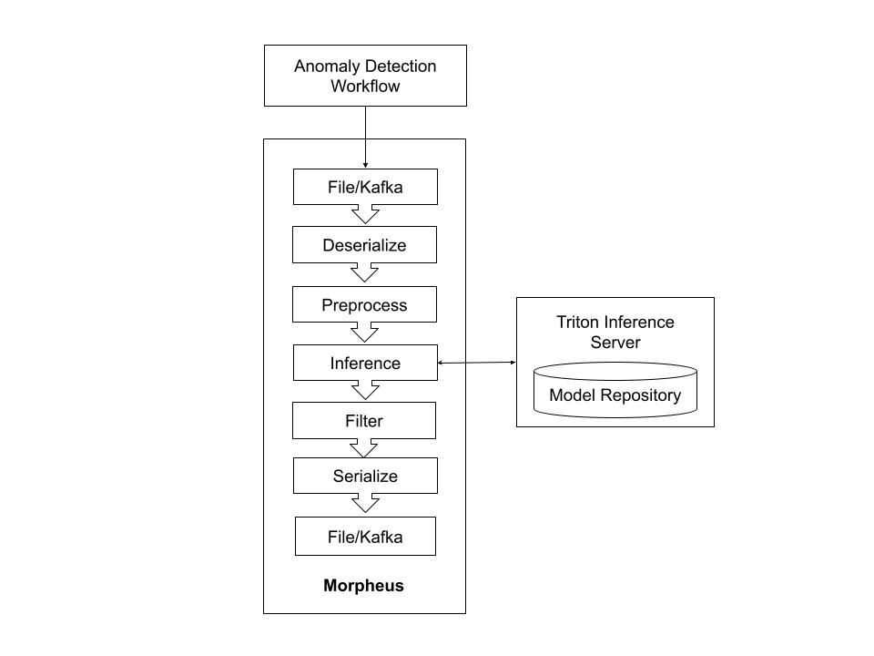

<!--
# Copyright (c) 2021, NVIDIA CORPORATION. All rights reserved.
#
# Redistribution and use in source and binary forms, with or without
# modification, are permitted provided that the following conditions
# are met:
#  * Redistributions of source code must retain the above copyright
#    notice, this list of conditions and the following disclaimer.
#  * Redistributions in binary form must reproduce the above copyright
#    notice, this list of conditions and the following disclaimer in the
#    documentation and/or other materials provided with the distribution.
#  * Neither the name of NVIDIA CORPORATION nor the names of its
#    contributors may be used to endorse or promote products derived
#    from this software without specific prior written permission.
#
# THIS SOFTWARE IS PROVIDED BY THE COPYRIGHT HOLDERS ``AS IS'' AND ANY
# EXPRESS OR IMPLIED WARRANTIES, INCLUDING, BUT NOT LIMITED TO, THE
# IMPLIED WARRANTIES OF MERCHANTABILITY AND FITNESS FOR A PARTICULAR
# PURPOSE ARE DISCLAIMED.  IN NO EVENT SHALL THE COPYRIGHT OWNER OR
# CONTRIBUTORS BE LIABLE FOR ANY DIRECT, INDIRECT, INCIDENTAL, SPECIAL,
# EXEMPLARY, OR CONSEQUENTIAL DAMAGES (INCLUDING, BUT NOT LIMITED TO,
# PROCUREMENT OF SUBSTITUTE GOODS OR SERVICES; LOSS OF USE, DATA, OR
# PROFITS; OR BUSINESS INTERRUPTION) HOWEVER CAUSED AND ON ANY THEORY
# OF LIABILITY, WHETHER IN CONTRACT, STRICT LIABILITY, OR TORT
# (INCLUDING NEGLIGENCE OR OTHERWISE) ARISING IN ANY WAY OUT OF THE USE
# OF THIS SOFTWARE, EVEN IF ADVISED OF THE POSSIBILITY OF SUCH DAMAGE.
-->

# Anomaly Detection Example Using Morpheus

### Workflow Architecture

For each input log, this workflow uses multiple Morpheus stages.



### Generate Sample Data
```
$ python pcap_data_producer.py --help
Usage: pcap_data_producer.py [OPTIONS]

Options:
  --count INTEGER  The number of logs that must be produced
  --file TEXT      The path to the file where the created logs will be saved.
  --help           Show this message and exit.

```

### FIL Backend Triton Inference Server

##### Download source code

```
git clone https://github.com/wphicks/triton_fil_backend
```
##### Build Docker Image

```
docker build -t triton_fil -f ops/Dockerfile .
```

##### Load PreTrained Models
Place pre-trained anomaly detection model and its configuration settings to the directory that binds to the tritonserver model repository.

```
cp -R anomaly_detection_fil_model $PWD/models
```

##### Deploy Triton Inference Server

```
docker run --gpus=all --rm -p 8000:8000 -p 8001:8001 -p 8002:8002 -v $PWD/models:/models --name tritonserver  triton_fil tritonserver --model-repository=/models --exit-on-error=false --model-control-mode=poll --repository-poll-secs=30
```

##### Verify Model Deployment
```
docker logs -f --tail 20 tritonserver
```
```
I0503 15:02:00.712347 1 model_repository_manager.cc:787] loading: anomaly_detection_fil_model:1
I0503 15:02:00.813845 1 api.cu:86] TRITONBACKEND_ModelInitialize: anomaly_detection_fil_model (version 1)
I0503 15:02:00.815445 1 api.cu:129] TRITONBACKEND_ModelInstanceInitialize: anomaly_detection_fil_model_0 (GPU device 0)
I0503 15:02:00.877995 1 api.cu:129] TRITONBACKEND_ModelInstanceInitialize: anomaly_detection_fil_model_0 (GPU device 1)
I0503 15:02:00.883463 1 api.cu:129] TRITONBACKEND_ModelInstanceInitialize: anomaly_detection_fil_model_0 (GPU device 0)
I0503 15:02:00.890421 1 api.cu:129] TRITONBACKEND_ModelInstanceInitialize: anomaly_detection_fil_model_0 (GPU device 1)
I0503 15:02:00.903511 1 model_repository_manager.cc:960] successfully loaded 'anomaly_detection_fil_model' version 1
```


### Anomaly Detection Pipeline
Use Morpheus to run the Anomaly Detection Pipeline with the previously created input dataset.

```
python cli.py run \
	--num_threads=8 \
	--pipeline_batch_size=<Streamz uses the pipeline batch size to poll messages at regular intervals> \
	--model_max_batch_size=<maximum number of logs send to triton-server in a single request> \
	pipeline-fil \
	--model_fea_length=<number of features used in the model> \
	from-file \
	--filename=<input file path> \
	deserialize \
	preprocess \
	inf-triton \
	--model_name=<model name in the triton-server model repository> \
	--server_url=<triton-server grpc service url> \
	serialize \
	to-file \
	--filename=<output file path>
```
